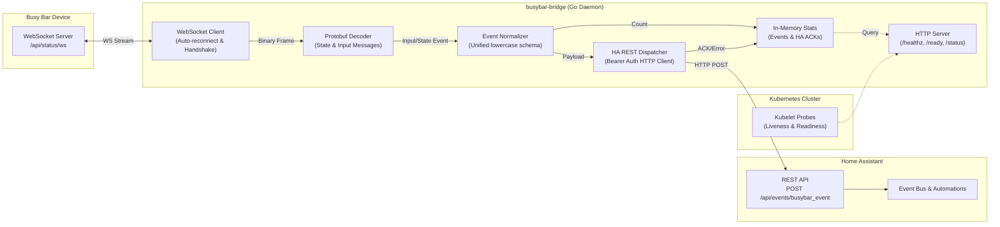

# Project Intent: BusyBar Bridge (`busybar-bridge`)

## 1. Executive Summary

`busybar-bridge` is a lightweight, persistent bridge daemon written in Go that connects to a **Busy Bar** smart display over its local WebSocket API (`ws://<BUSYBAR_HOST>/api/status/ws`), decodes incoming binary Protocol Buffer state events (primarily user inputs like button presses, switch toggles, and encoder turns), and dispatches them in real-time as custom events to **Home Assistant** via its REST API (`POST /api/events/<event_type>`).

The service runs containerized on **Kubernetes**, adheres to 12-factor configuration principles, and exposes an embedded HTTP observability server that provides health/readiness probes alongside real-time metrics tracking received Busy Bar events and Home Assistant delivery acknowledgments (ACKs).

---

## 2. Architecture & Data Flow



---

## 3. Core Functional Requirements

### 3.1. Busy Bar WebSocket Streaming
- **Connection Target**: `ws://<BUSYBAR_HOST>:<PORT>/api/status/ws`.
- **Stream Handshake**: Upon establishing connection, the bridge immediately sends the JSON control payload:
  ```json
  {"enable": true}
  ```
- **Connection Lifecycle & Resilience**:
  - Continuous supervision loop with exponential backoff and jitter upon disconnection or connection failure (initial retry: 1s, max: 60s, factor: 1.5).
  - Handles network hiccups, Wi-Fi drops, and device reboots indefinitely without crashing the bridge.
  - Periodic ping/pong and read deadlines to detect stale/dead TCP connections.

### 3.2. Binary Protobuf Processing
- **Schema Source**: Based on the official Busy Bar protobuf schemas (`https://github.com/busy-app/busybar-protobuf`).
- **Binary Frame Deserialization**: Incoming binary frames are parsed into `BSB_State.State` messages containing repeated `StateUpdate` items.
- **Event Scope**:
  - **Input Events (`BSB_Input.InputEvent`)**:
    - **Buttons (`ButtonEvent`)**:
      - `button`: `OK` (0), `BACK` (1), `START` (2)
      - `action`: `PRESS` (0), `RELEASE` (1)
    - **Switch (`SwitchEvent`)**:
      - `position`: `BUSY` (0), `CUSTOM` (1), `OFF` (2), `APPS` (3), `SETTINGS` (4)
    - **Rotary Encoder (`EncoderEvent`)**:
      - `delta`: signed integer increment/decrement step (e.g., `+1`, `-1`)
  - **Extensible State Updates**: Architecture allows optional forwarding of system state changes (such as `timer`, `brightness`, `battery/power`, `wifi`) if enabled by configuration.

### 3.3. Home Assistant Event Dispatching
- **Target Endpoint**: `POST <HASS_URL>/api/events/<HASS_EVENT_TYPE>`.
- **Authentication**: `Authorization: Bearer <HASS_TOKEN>` header.
- **Delivery Semantics (Real-Time Best Effort)**:
  - Events are posted synchronously or via a low-latency non-blocking dispatcher.
  - In case of transient Home Assistant HTTP failures (e.g. 5xx or connection drop), a brief retry (1-2 attempts within ~1-2 seconds) is performed.
  - Events are **not** buffered into a long-lived persistent queue when Home Assistant is down for extended periods, preventing stale "ghost" button clicks from triggering automations upon recovery.

### 3.4. HTTP Observability & Health Server
- **Server Port**: Configurable via `PORT` (default `:8080`).
- **Endpoints**:
  - `GET /healthz`: Process liveness probe (returns `200 OK` if the process is healthy).
  - `GET /ready`: Readiness probe (returns `200 OK` when the WebSocket stream to Busy Bar is active and connected, `503 Service Unavailable` during reconnect backoff).
  - `GET /status`: JSON diagnostic & observability endpoint reporting:
    - Busy Bar connection state (`connected`, `reconnect_count`, `last_connected_at`, `last_disconnected_at`).
    - Event counters categorized by type (`buttons`, `switches`, `encoders`, `other`).
    - Home Assistant delivery telemetry:
      - Total events posted.
      - HTTP 200 OK acknowledgments received.
      - Failed deliveries and error reasons.
      - Latency of last successful delivery.
    - Rolling circular buffer of recent events and their delivery status (e.g., last 20 events).

### 3.5. Directionality & Device Scope
- **Directionality**: **Strictly unidirectional** (Busy Bar -> Home Assistant). No reverse command or display update path is within the scope of this bridge.
- **Device Scope**: **Single Busy Bar per container instance** (1:1 mapping). For multiple Busy Bars, multiple Kubernetes Pods/Deployments are deployed.

---

## 4. Home Assistant Event Schema

All events forwarded to Home Assistant use a unified event type (default: `busybar_event`) with lowercase, snake_case keys and string enum values matching standard Home Assistant event conventions (similar to `zha_event` or `deconz_event`).

### 4.1. Button Event
```json
{
  "device": "busybar",
  "type": "button",
  "button": "ok",
  "action": "press",
  "timestamp": 1726180000
}
```

### 4.2. Switch Event
```json
{
  "device": "busybar",
  "type": "switch",
  "position": "busy",
  "timestamp": 1726180001
}
```

### 4.3. Rotary Encoder Event
```json
{
  "device": "busybar",
  "type": "encoder",
  "delta": 1,
  "timestamp": 1726180002
}
```

### 4.4. Example Home Assistant Automation
```yaml
alias: "Busy Bar OK Button Press"
trigger:
  - trigger: event
    event_type: busybar_event
    event_data:
      type: button
      button: ok
      action: press
action:
  - action: light.toggle
    target:
      entity_id: light.desk_lamp
```

---

## 5. Configuration Specification

The bridge follows 12-factor application design, reading settings from environment variables with CLI flag overrides.

| Environment Variable | CLI Flag | Default Value | Description |
|---|---|---|---|
| `BUSYBAR_HOST` | `--busybar-host` | `192.168.68.196` | IP or hostname of the Busy Bar device |
| `BUSYBAR_PORT` | `--busybar-port` | `80` | HTTP/WebSocket port on the Busy Bar |
| `BUSYBAR_DEVICE_ID` | `--device-id` | `busybar` | Device identifier injected into event payloads |
| `HASS_URL` | `--hass-url` | `http://homeassistant.local:8123` | Base URL of Home Assistant instance |
| `HASS_TOKEN` | `--hass-token` | *(Required)* | Home Assistant Long-Lived Access Token |
| `HASS_EVENT_TYPE` | `--hass-event-type` | `busybar_event` | Custom event name fired in Home Assistant |
| `HASS_TIMEOUT` | `--hass-timeout` | `5s` | Timeout for Home Assistant HTTP POST requests |
| `FORWARD_STATE_EVENTS` | `--forward-state-events` | `false` | Enable forwarding of non-input state updates |
| `PORT` | `--port` | `8080` | Port for embedded HTTP health & status server |
| `LOG_LEVEL` | `--log-level` | `info` | Logging verbosity (`debug`, `info`, `warn`, `error`) |

---

## 6. Protobuf & Codebase Organization

### 6.1. Protobuf Strategy
- Go structs generated from upstream `.proto` definitions are **checked directly into source control** under `pkg/pb/` or `proto/`.
- This ensures reproducible, self-contained builds in CI and Docker without fetching external Git repositories during compile time.
- A `Makefile` target (`make proto-sync`) automates downloading the latest `.proto` definitions from `busy-app/busybar-protobuf` and compiling them using `protoc-gen-go`.

### 6.2. Target Project Structure
```text
.
├── .devcontainer/             # Existing devcontainer configuration
├── .github/
│   └── workflows/
│       └── ci.yaml            # Lint, test, and container build CI
├── cmd/
│   └── busybar-bridge/
│       └── main.go            # Daemon entrypoint, flag parsing, signal handling
├── internal/
│   ├── busybar/
│   │   ├── client.go          # WebSocket client with auto-reconnect & handshake
│   │   ├── client_test.go     # Unit tests with mock WebSocket server
│   │   └── decoder.go         # Protobuf decoding & event extraction
│   ├── config/
│   │   ├── config.go          # Environment variable & flag loader
│   │   └── config_test.go     # Config validation tests
│   ├── hass/
│   │   ├── client.go          # REST API event dispatcher (Bearer token auth)
│   │   ├── client_test.go     # Unit tests with mock HA HTTP server
│   │   └── event.go           # Event payload definitions & JSON serialization
│   └── server/
│       ├── server.go          # HTTP server (/healthz, /ready, /status)
│       ├── server_test.go     # HTTP endpoint tests
│       └── stats.go           # Thread-safe event counter & HA ACK tracker
├── pkg/
│   └── pb/                    # Checked-in protoc-gen-go generated code
├── Dockerfile                 # Multi-stage lightweight scratch/distroless build
├── Makefile                   # Build, test, lint, and proto-sync commands
├── INTENT.md                  # Project design specification (this document)
├── go.mod                     # Go module definition
└── go.sum                     # Go module checksums
```

---

## 7. Operational & Kubernetes Lifecycle

- **Signals**: Intercepts `SIGTERM` and `SIGINT` for graceful shutdown:
  1. Stops accepting/processing new events.
  2. Closes WebSocket connection cleanly with `CloseNormalClosure`.
  3. Shuts down HTTP observability server.
  4. Exits with status 0 within Kubernetes grace period (default 30s).
- **Probes**:
  - `livenessProbe`: HTTP GET to `/healthz` on `PORT`.
  - `readinessProbe`: HTTP GET to `/ready` on `PORT`.
- **Packaging**: Multi-stage `Dockerfile` compiling a statically linked Go binary running as a non-root user in a minimal image (e.g. `gcr.io/distroless/static` or `alpine`).

---

## 8. Testing & Quality Assurance

- **Unit Testing**:
  - WebSocket reconnection and frame decoding tested against an `httptest` mock WebSocket server.
  - Home Assistant event forwarding and retry behavior tested against an `httptest` mock HTTP server validating headers, status codes, and payloads.
  - Concurrent thread safety testing for the statistics and ACK tracker.
- **CI Pipeline (`.github/workflows/ci.yaml`)**:
  - `golangci-lint` for static analysis.
  - `go test -v -race -cover ./...` ensuring race detection and test coverage.
  - Multi-platform Docker container build verification.
